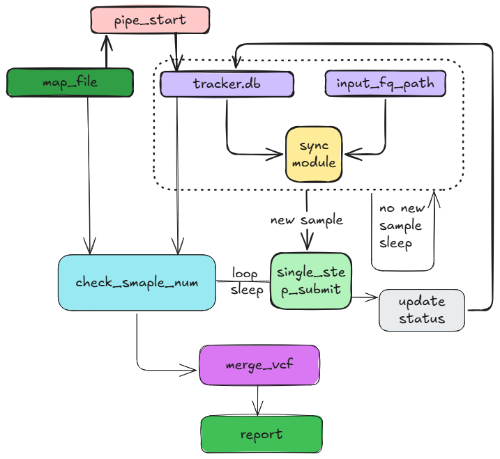
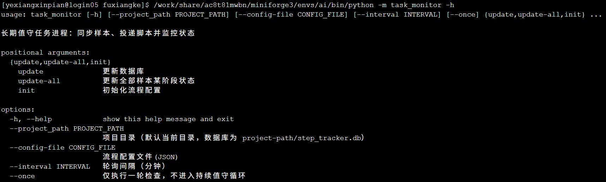
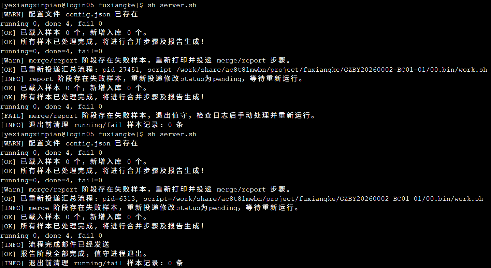

# 液相芯片分析流程
## 目录
- [液相芯片分析流程](#液相芯片分析流程)
  - [目录](#目录)
  - [一、流程图](#一流程图)
  - [二、流程描述](#二流程描述)
  - [三、流程运行示例](#三流程运行示例)

## 一、流程图

## 二、流程描述
该流程用于曙光云上液相芯片数据分析，流程是一个名为task_monitor的模块，兼具了任务值守，流程输入文件初始化，流程步骤状态更新，邮件通知发送等功能。

2.1、任务值守
```
/work/share/ac8t81mwbn/miniforge3/envs/ai/bin/python -m task_monitor --project_path $PWD --config-file config.json --interval 1
```

2.2、流程输入文件初始化
```
/work/share/ac8t81mwbn/miniforge3/envs/ai/bin/python -m task_monitor init --project_name 鸡 --contract GZBY20260002-BC01-01 --customer XXX公司 --chip-name ji_11K-1 --upload_path $PWD/raw_data --map-file $PWD/mapfile --cpu 20
```

2.3、流程步骤状态更新
```
/work/share/ac8t81mwbn/miniforge3/envs/ai/bin/python -m task_monitor --project_path /work/share/ac8t81mwbn/project/fuxiangke --config-file /work/share/ac8t81mwbn/project/fuxiangke/config.json update --sample K0039896398 --status done
```

2.4、邮件通知发送
邮件通知由主值守进程发送，在流程第一次启动或者重跑时会有启动流程通知，在report步骤完成时会有流程任务结束通知

## 三、流程运行示例
3.1、流程初始化
```
export PYTHONPATH=/work/share/ac8t81mwbn/pipline/yexiang_chip_analysis
/work/share/ac8t81mwbn/miniforge3/envs/ai/bin/python -m task_monitor init --project_name 鸡 --contract GZBY20260002-BC01-01 --customer XXX公司 --chip-name ji_11K-1 --upload_path $PWD/raw_data --map-file $PWD/mapfile --cpu 20
/work/share/ac8t81mwbn/miniforge3/envs/ai/bin/python -m task_monitor --project_path $PWD --config-file config.json --interval 1
```
mapfile文件格式如下：
```
sample1   sample1_1.clean.fq.gz   sample1_2.clean.fq.gz
sample2   sample2_1.clean.fq.gz   sample2_2.clean.fq.gz
```
其余选项可查看命令行参数帮助
3.2、流程帮助


3.3、流程运行输出日志示例

